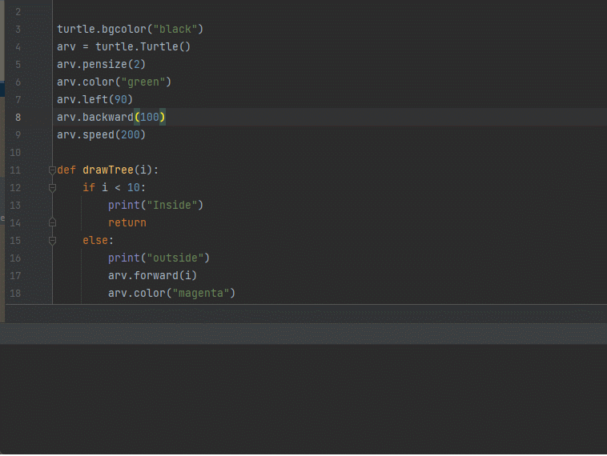
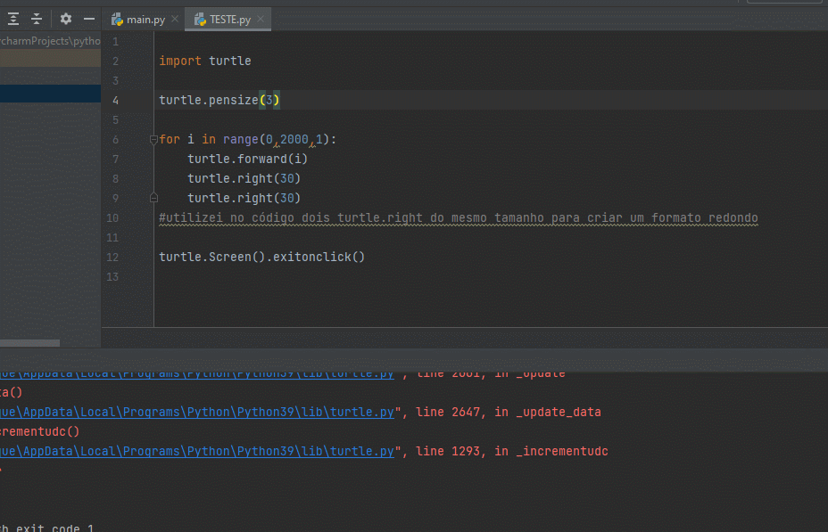

## Fractal

<h1>Projeto desenvolvido em aula sobre fractal</h1>

>Código fractal árvore

<p align="center">
    
</p>

```javascript
import turtle

# configuração da tela da imagem
turtle.bgcolor("black")
arv = turtle.Turtle()
arv.pensize(2)
arv.color("green")
arv.left(90)
arv.backward(100)
arv.speed(200)

#direção dos galhos da árvore
def drawTree(i):
    if i < 10:
        print("Inside")
        return
    else:
        print("outside")
        arv.forward(i)
        arv.color("magenta")
        arv.circle(2)
        arv.color("brown")
        arv.left(30)
        drawTree(3*i/4)
        arv.right(60)
        drawTree(3*i/4)
        arv.left(30)
        arv.backward(i)

drawTree(100)
turtle.done()
```

>Meu fractal

Com base nos conhecimentos adiquiridos foi possível fazer um fractal em formato circular e continuo. 

<p align="center">
    
</p>

```javascript
import turtle

turtle.pensize(1)

for i in range(0,2000,1):
    turtle.forward(i)
    turtle.right(30)
    turtle.right(30)
#utilizei no código dois turtle.right do mesmo tamanho para criar um formato redondo

turtle.Screen().exitonclick()
```

>Código fractal floco de neve

 Em resumo, o código define as variáveis necessárias para gerar um fractal.
 A variável "generation" especifica quantas gerações do sistema devem ser calculadas, enquanto a variável "axiom"
 especifica a cadeia inicial. As variáveis "chr_1" e "rule_1" especificam a regra de substituição que será
 usada para gerar a cadeia de caracteres do fractal. A variável "step" especifica o comprimento da linha que a cadeia de caracteres do fractal. 

<p align="center">
    
</p>

```javascript
import time
import turtle

#Config. a tela de impressão do desenho
WIDTH, HEIGHT = 1600, 900
screen = turtle.Screen()
screen.setup(WIDTH, HEIGHT)
screen.screensize(2*WIDTH, 2*HEIGHT)
screen.bgcolor('black')
screen.delay(0)

#Config. Turtle
trig = turtle.Turtle()
trig.pensize(2)
trig.speed(1)
trig.setpos(-WIDTH // 6, HEIGHT // 6)
trig.color('gold')

# L-system
generation = 5
axiom = 'F++F++F'
chr_1, rule_1 = 'F', 'F-F++F-F'
#chr_2, rule_2 = 'G', 'GG'
step = 600
angle = 60

def apply_rules(axiom):
    return ''.join([rule_1 if chr == chr_1 else chr for chr in axiom])

for gen in range(generation):
    turtle.pencolor('white')
    turtle.goto(-WIDTH // 2 + 60, HEIGHT // 2 - 100)
    turtle.clear()
    turtle.write(f'Geração: {generation}', font=('Arial', 60, "normal"))

    trig.setheading(0)
    trig.goto(-WIDTH // 6, HEIGHT // 6)
    trig.clear()

    length = step / pow(3, gen)

    for chr in axiom:
        if chr == chr_1:
            trig.forward(length)
        elif chr == '+':
            trig.right(angle)
        elif chr == '-':
            trig.left(angle)

    axiom = apply_rules(axiom)

screen.exitonclick()
```